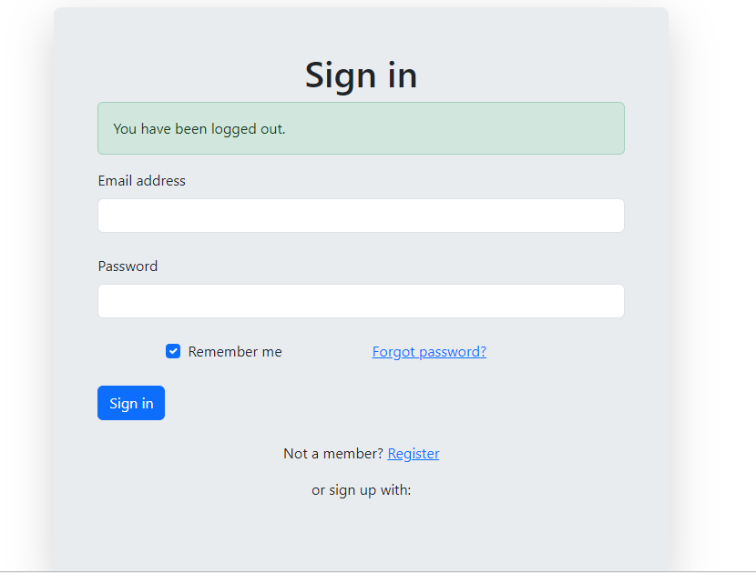
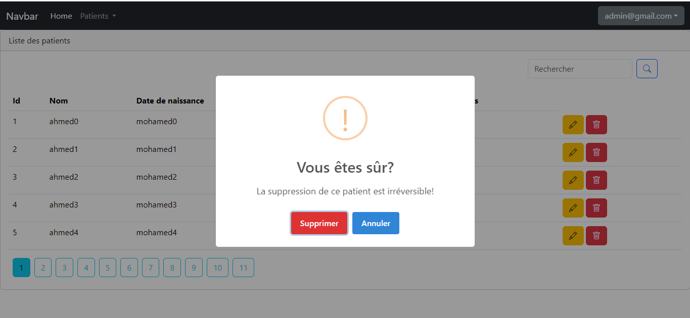
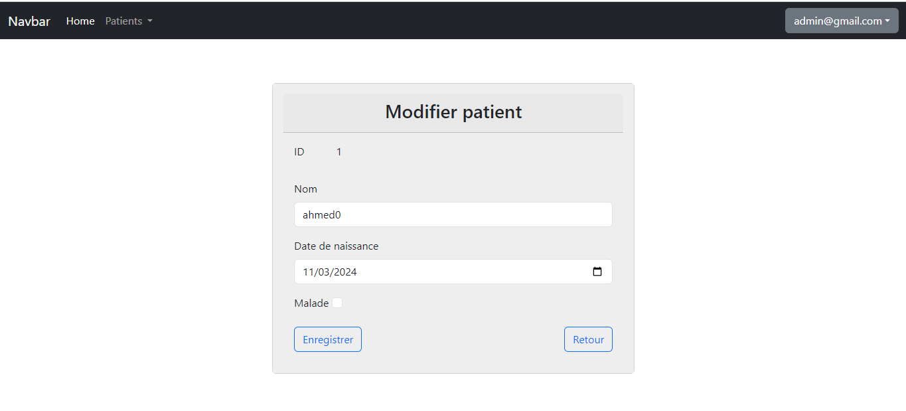

# Rapport de l'Application Gestion des Patients

## Introduction

Ce rapport présente une application de gestion des patients développée dans le cadre de technologies Java EE (JEE) basées sur Spring MVC, Thymeleaf, Spring Data JPA et Spring Security. L'objectif principal de cette application est de fournir un système permettant de gérer les informations des patients dans un environnement hospitalier.

## Fonctionnalités

L'application propose les fonctionnalités suivantes :

1. Login

2. Affichage des patients.
3. Pagination des résultats.
4. Recherche de patients.

- Home Admin

- Home User

5. Suppression d'un patient.

6. Modification d'un patient.

8. Sécurité avec Spring Security.

## Développement de l'Application

L'application est développée en suivant une approche modulaire et orientée objet. Les principales technologies utilisées sont :

- Spring MVC : Pour la création d'une architecture Web robuste basée sur le modèle MVC (Modèle-Vue-Contrôleur).
- Thymeleaf : Pour la création de vues HTML dynamiques et basées sur les modèles.
- Spring Data JPA : Pour la gestion des données persistantes avec une approche basée sur les interfaces et l'annotation.
- Spring Security : Pour la gestion de l'authentification, de l'autorisation et de la protection des ressources.

## Structure de l'Application

L'application est structurée selon une architecture de projet standard avec les packages suivants :

- `org.example.gestion_patients` : Package principal de l'application.
- `entities` : Contient les entités JPA représentant les objets métier de l'application.
- `repositories` : Contient les interfaces de répertoire Spring Data JPA pour l'accès aux données.
- `security` : Contient les classes de configuration et de services liées à la sécurité.
- `controllers` : Contient les contrôleurs Spring MVC pour gérer les requêtes HTTP.
- `services` : Contient les services de l'application pour la logique métier.
- `templates` : Contient les fichiers de modèle Thymeleaf pour la création des vues.
- `static` : Contient les ressources statiques telles que les fichiers CSS, JavaScript et les images.

## Authentification

L'authentification dans l'application est gérée en utilisant l'authentification en mémoire avec Spring Security. Les utilisateurs et les rôles sont définis dans le code, comme indiqué dans le code de configuration.

## Conclusion

Ce Travail a été une expérience enrichissante dans le développement d'applications Web JEE avec Spring et Thymeleaf. L'application offre la gestion des patients dans un environnement hospitalier, avec des fonctionnalités essentielles telles que l'affichage, la recherche, la pagination et la suppression des patients.

Pour plus de détails sur l'implémentation, veuillez vous référer au code source complet de l'application.

---